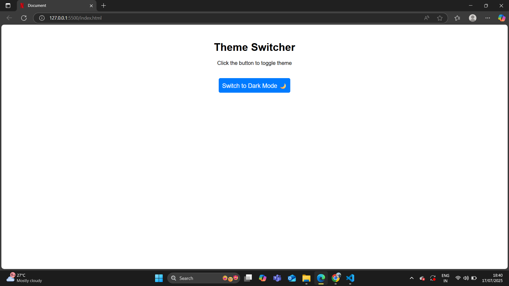

# 🌗 Theme Switcher App

A simple **Theme Switcher (Light/Dark Mode)** app built using **HTML, CSS, and JavaScript**.  
This app allows users to toggle between light and dark themes with a smooth transition effect.

---

## ✅ Features
- 🌞 **Light Mode** and 🌙 **Dark Mode**
- Smooth theme transition
- Simple and responsive design
- Built using **Vanilla JavaScript**

---

## 🛠 Tech Stack
- **HTML** – Structure  
- **CSS** – Styling  
- **JavaScript** – Functionality  

---

## 📸 Screenshot
  

---

## 🚀 Live Demo
[Click Here to View the App](https://your-username.github.io/theme-switcher-app/)  

